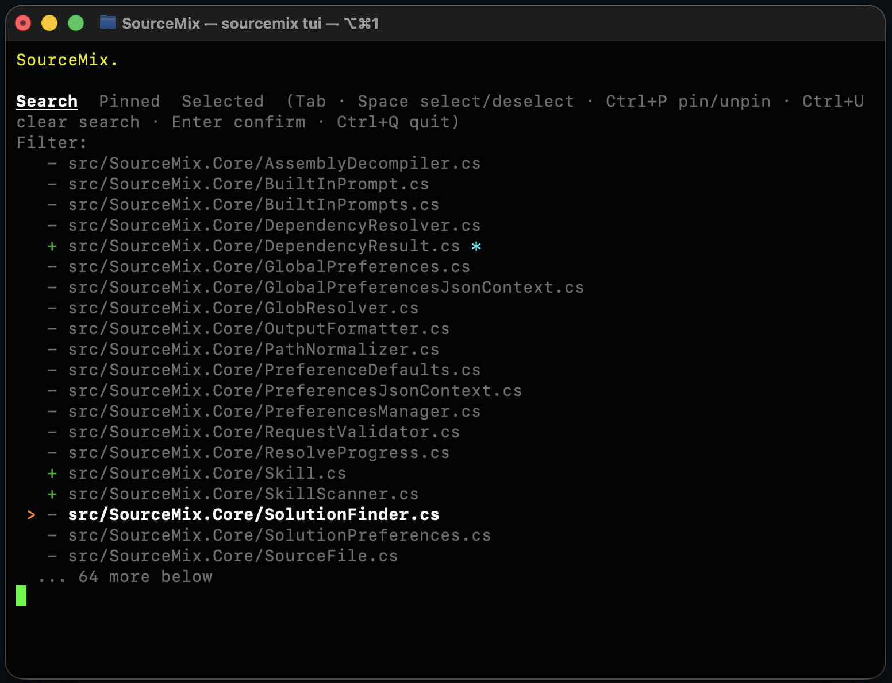
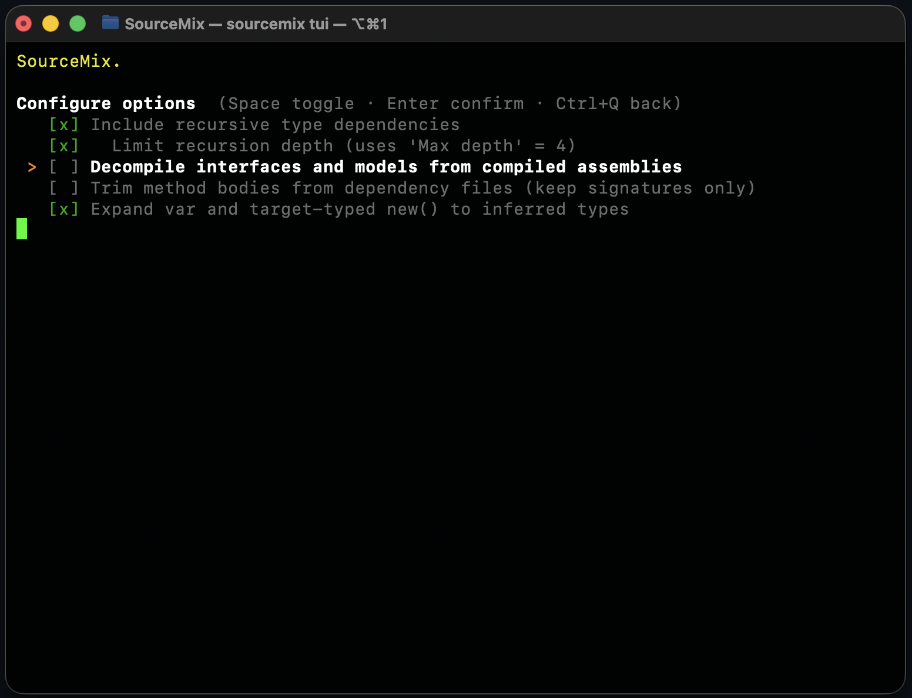
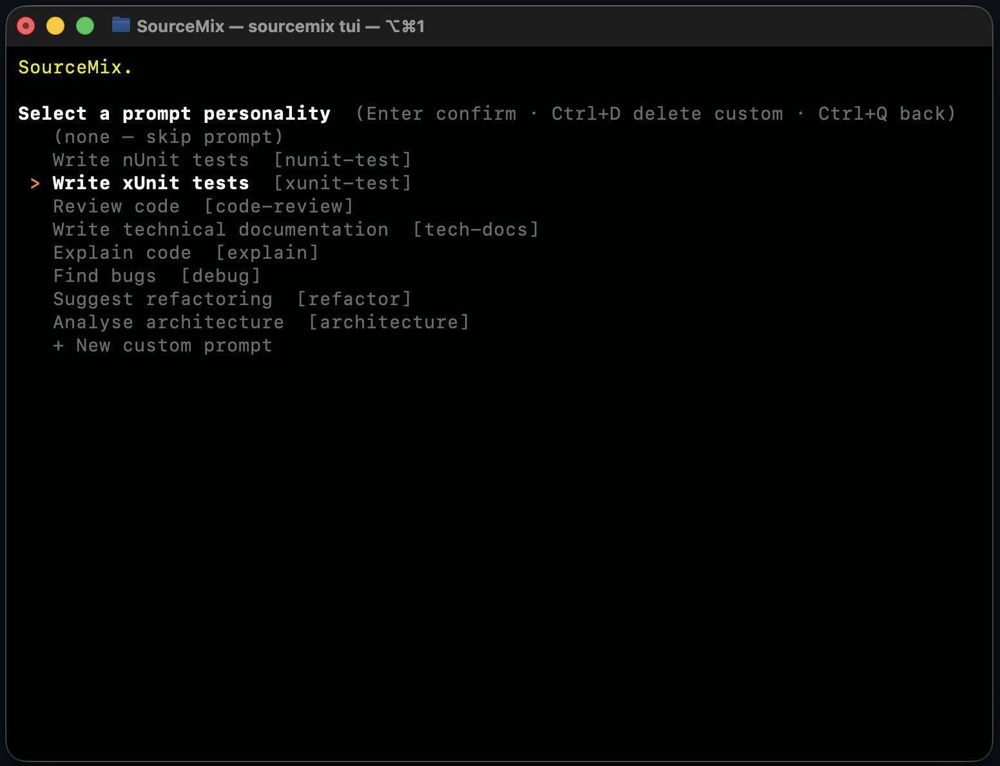
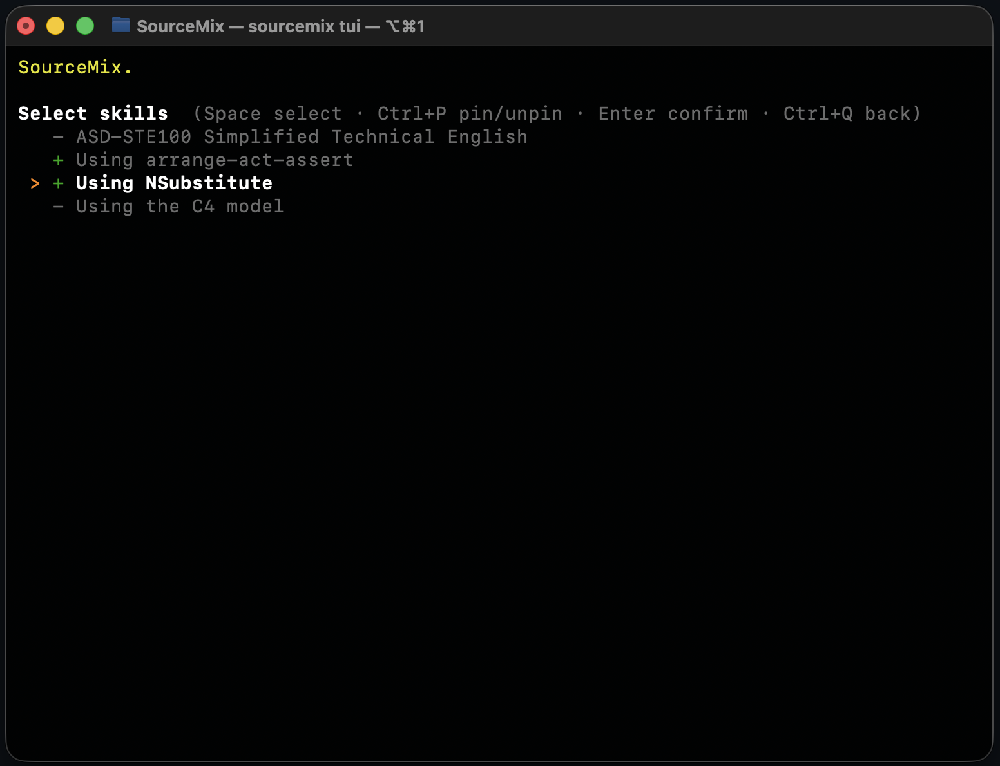

# Source Mix

SourceMix turns selected C# source files into a single Markdown context file that is easier to hand to an LLM. You can use it in two ways from the same installed dotnet tool:

- **CLI mode** for scripted or repeatable runs
- **TUI mode** for interactive file picking and option selection

The tool can include just the files you select, or expand outward to referenced source types, optional decompiled dependency types, reusable skills, and a final prompt block.

<div style="display: flex; justify-content: center; gap: 20px; flex-wrap: wrap;">
  <figure style="margin: 0; padding: 0; text-align: center;">
      
      <figcaption style="margin-top: 6px;">The SourceMix TUI showing the file selection screen.</figcaption>
  </figure>
  <figure style="margin: 0; padding: 0; text-align: center;">
    
    <figcaption style="margin-top: 6px;">The SourceMix TUI showing the output file configuration screen.</figcaption>
  </figure>
</div>
<br/>
<div style="display: flex; justify-content: center; gap: 20px; flex-wrap: wrap;">
  <figure style="margin: 0; padding: 0; text-align: center;">
      
      <figcaption style="margin-top: 6px;">The SourceMix TUI showing the prompt personality screen.</figcaption>
  </figure>
  <figure style="margin: 0; padding: 0; text-align: center;">
    
    <figcaption style="margin-top: 6px;">The SourceMix TUI showing the skills selection screen.</figcaption>
  </figure>
</div>

## Install

Install the tool globally from NuGet:

```bash
dotnet tool install --global HenrikJensen.SourceMix
```

After that, use the `sourcemix` command.

Update an existing installation:

```bash
dotnet tool update --global HenrikJensen.SourceMix
```

Uninstall it:

```bash
dotnet tool uninstall --global HenrikJensen.SourceMix
```

## Quick start

Use the interactive experience when you want help choosing files:

```bash
sourcemix tui
```

Use the CLI when you already know the files or patterns you want:

```bash
sourcemix "src/**/*.cs" -o context.md
```

## TUI usage

Run the TUI from any directory containing a `.sln` or `.slnx` file:

```bash
sourcemix tui
```

### Wizard flow

1. **Search and select files** — type to filter `.cs` files by name in real time, move with `↑↓`, toggle with `Space`, pin with `Ctrl+P`, confirm with `Enter`, and switch views with `Tab`.
2. **Configure options** — choose recursive dependency resolution, optional depth limiting, decompilation of compiled types, whether dependency method bodies should be trimmed, and whether `var` / target-typed `new()` should be expanded to inferred types.
3. **Select prompt** — optionally append a built-in or custom prompt to the generated output.
4. **Select skills** — optionally prepend one or more `SKILL.md` instruction files.
5. **Generate** — write the final Markdown output and persist your preferences for the next run.

> **Note:** `--include-compiled` depends on assemblies that already exist in `bin/`, so run `dotnet build` first.

## CLI usage

```bash
sourcemix [<files>...] [--output <path>] [--recursive] [--depth <n>] [--include-compiled] [--trim] [--expand-types]
```

### Arguments

- `<files>` — one or more file paths or glob patterns such as `src/**/*.cs`

### Options

- `-o`, `--output <path>` — write output to a file instead of stdout
- `-r`, `--recursive` — include files that define referenced types
- `-d`, `--depth <n>` — limit recursion depth when `--recursive` is used
- `-c`, `--include-compiled` — decompile unresolved referenced interfaces/models from compiled assemblies; requires `--recursive`
- `-t`, `--trim` — trim dependency method bodies while keeping signatures; requires `--recursive`
- `-e`, `--expand-types` — replace `var` with the inferred type and expand target-typed `new()` to include the type; anonymous types, tuple deconstruction, and unresolved cases are left unchanged
- `-p`, `--prompt <name-or-text>` — append a built-in prompt key or custom prompt text
- `-s`, `--skills <key>...` — prepend one or more skills by key

### Built-in prompts

- `nunit-test`
- `xunit-test`
- `code-review`
- `tech-docs`
- `explain`
- `debug`
- `refactor`
- `architecture`

### Examples

```bash
# Write a context file from a glob
sourcemix "src/**/*.cs" -o context.md

# Print selected files to stdout
sourcemix Foo.cs Bar.cs Baz.cs

# Pull in referenced source types and decompiled unresolved types
sourcemix MyService.cs -r -c -o context.md

# Trim dependency bodies and append an xUnit-focused prompt
sourcemix MyService.cs -r -t --prompt xunit-test -o context.md

# Expand inferred types before writing the context file
sourcemix MyService.cs -r -e -o context.md

# Add skills plus a code review prompt
sourcemix MyService.cs -r -t --skills unit-test-style architecture-rules --prompt code-review -o context.md
```

## Preferences

SourceMix stores per-solution preferences after TUI runs, including pinned files, pinned skills, output path, last-used prompt, and default options.

| Platform | Location |
|---|---|
| Windows | `%APPDATA%\sourcemix\sourcemix-<hash>.json` |
| Linux | `~/.config/sourcemix/sourcemix-<hash>.json` |
| macOS | `~/.config/sourcemix/sourcemix-<hash>.json` |

Global custom prompts are stored separately:

| Platform | Location |
|---|---|
| Windows | `%APPDATA%\sourcemix\sourcemix-global.json` |
| Linux | `~/.config/sourcemix/sourcemix-global.json` |
| macOS | `~/.config/sourcemix/sourcemix-global.json` |

## Skills

Skills are reusable Markdown instructions inserted before the collected code. Each skill lives in its own directory and must contain a `SKILL.md` file. A skill file cannot reference other files.

| Platform | Location |
|---|---|
| Windows | `%APPDATA%\sourcemix\skills\` |
| Linux | `~/.config/sourcemix/skills/` |
| macOS | `~/.config/sourcemix/skills/` |

Example:

```text
~/.config/sourcemix/skills/
  unit-test-style/
    SKILL.md
  architecture-rules/
    SKILL.md
```

## Local development

Restore tools and dependencies:

```bash
dotnet tool restore
./scripts/restore.bash
```

Build with the repository checks:

```bash
./scripts/build.bash
```

Run the tests:

```bash
./scripts/test.bash
```

Run the benchmarks to measure performance and detect regressions:

```bash
./scripts/benchmark.bash
```

Results are saved to `tmp/benchmark-latest.md` after each run. The previous run is kept as `tmp/benchmark-previous.md` for comparison.

Create the release package:

```bash
./scripts/pack.bash
```

## Pack and publish

Create the NuGet package:

```bash
./scripts/pack.bash
```

The package is written to:

```text
src/SourceMix/bin/Release/HenrikJensen.SourceMix.<version>.nupkg
```

Install that package locally for validation:

```bash
dotnet tool install --global --add-source ./src/SourceMix/bin/Release HenrikJensen.SourceMix
```

Publish it to NuGet:

```bash
dotnet nuget push src/SourceMix/bin/Release/HenrikJensen.SourceMix.<version>.nupkg --source https://api.nuget.org/v3/index.json --api-key <api-key>
```

`pack.bash` only creates the Release package. Run `./scripts/build.bash` and `./scripts/test.bash` separately as your validation steps before publishing.
